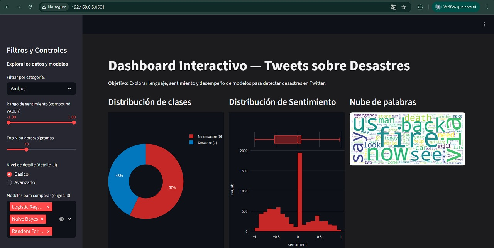
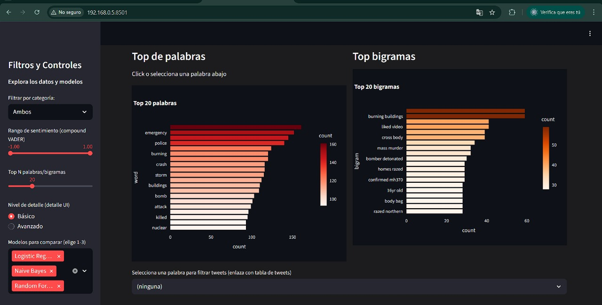
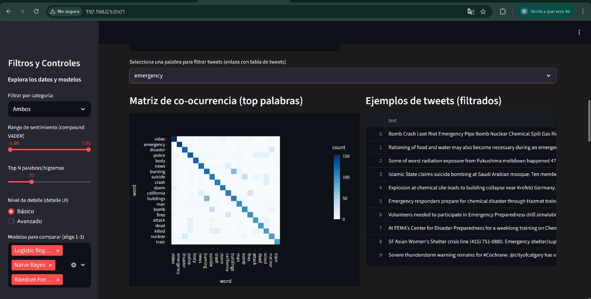
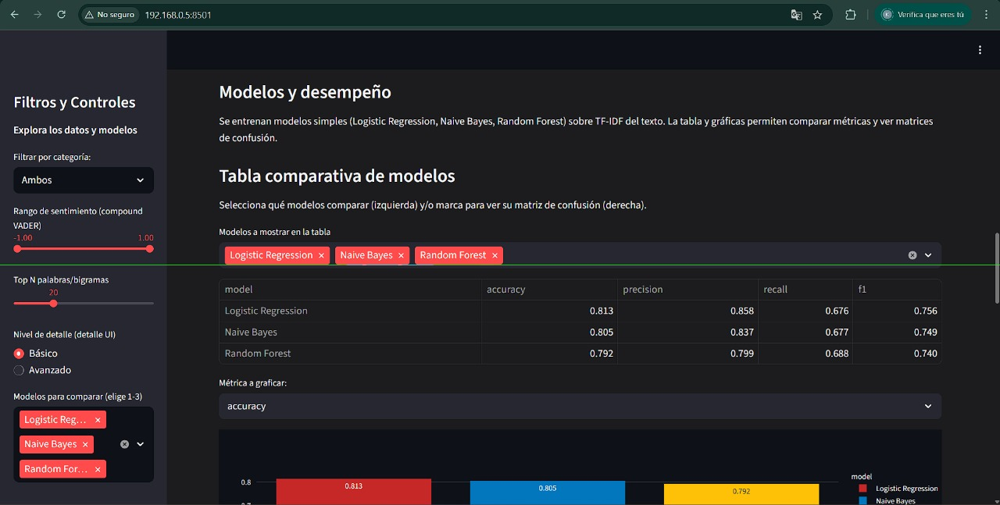
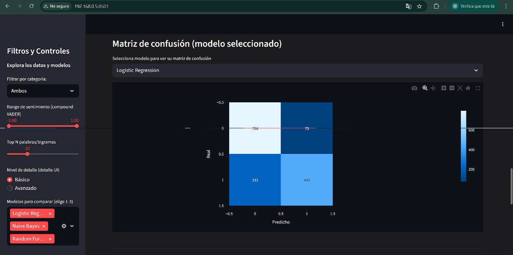
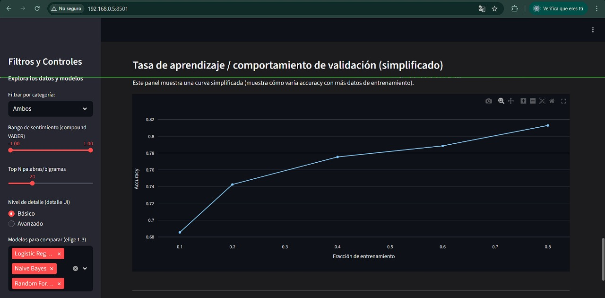

# Dashboard Interactivo de Tweets sobre Desastres

Este dashboard permite analizar, explorar y visualizar datos de tweets relacionados con situaciones de desastre.  
El objetivo principal es **identificar patrones lingüísticos y medir el desempeño de modelos de clasificación** que distinguen entre tweets reales de desastres y tweets que no se relacionan con desastres.

---

## Objetivos del Proyecto
- Explorar el lenguaje utilizado en mensajes relacionados con situaciones de emergencia.
- Analizar el sentimiento asociado a los tweets.
- Comparar el desempeño de al menos **3 modelos de clasificación**.
- Proveer una interfaz interactiva para **toma de decisiones basada en datos**.

---

## Dataset
El dataset utilizado contiene tweets clasificados como:
- **1 → Tweets relacionados con desastres**
- **0 → Tweets no relacionados**

Variables clave:
| Columna | Descripción |
|--------|-------------|
| `text` | Texto original del tweet |
| `clean_text` | Texto procesado (limpio, sin ruido) |
| `target` | Etiqueta de clase (0 o 1) |
| `sentiment` | Polaridad del texto usando VADER (-1 a 1) |

---

## Modelos de Clasificación Evaluados
Los siguientes modelos se entrenaron utilizando **TF-IDF** como representación del texto:

| Modelo | Descripción |
|-------|-------------|
| **Regresión Logística** | Modelo base lineal |
| **Naive Bayes** | Modelo probabilístico para texto |
| **Random Forest** | Ensamble de árboles de decisión |

Se compararon métricas:
- `accuracy`
- `precision`
- `recall`
- `f1-score`

Se incluyeron:
- **Matriz de Confusión**
- **Curvas ROC (modo Avanzado)**

---

## Visualizaciones Incluidas
El dashboard contiene al menos **8 visualizaciones interactivas**, entre ellas:

- Histograma de sentimiento
- Distribución de clases
- Nube de palabras
- Top palabras y bigramas
- Matriz de co-ocurrencia
- Tabla de tweets filtrados por palabra seleccionada
- Comparación de modelos y métricas
- Matrices de confusión dinámicas

---

## Interactividad
El usuario puede:
- Filtrar por categoría (desastre / no desastre / ambos)
- Ajustar el rango de sentimiento
- Elegir `Top-N` palabras y nivel de detalle
- Seleccionar una palabra para ver tweets donde aparece
- Activar modo **Avanzado** para análisis más profundo
- Elegir qué modelos comparar

---

## Instrucciones para Ejecutar Localmente

```bash
git clone https://github.com/Kapiven/Lab11DS.git
pip install -r requirements.txt
streamlit run app.py

```

## Vista del Dashboard








